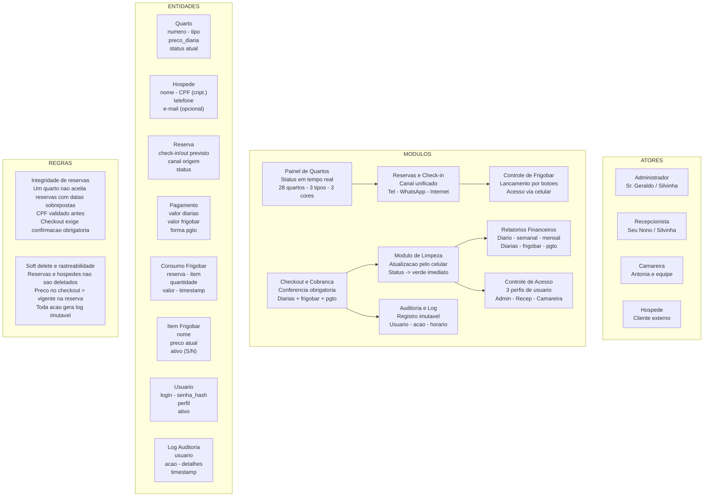

```mermaid
flowchart TB

subgraph ATORES
    A1["Administrador\nSr. Geraldo / Silvinha"]
    A2["Recepcionista\nSeu Nono / Silvinha"]
    A3["Camareira\nAntonia e equipe"]
    A4["Hospede\nCliente externo"]
end

subgraph MODULOS
    M1["Painel de Quartos\nStatus em tempo real\n28 quartos - 3 tipos - 3 cores"]
    M2["Reservas e Check-in\nCanal unificado\nTel - WhatsApp - Internet"]
    M3["Controle de Frigobar\nLancamento por botoes\nAcesso via celular"]

    M4["Checkout e Cobranca\nConferencia obrigatoria\nDiarias + frigobar + pgto"]
    M5["Modulo de Limpeza\nAtualizacao pelo celular\nStatus -> verde imediato"]
    M6["Relatorios Financeiros\nDiario - semanal - mensal\nDiarias - frigobar - pgto"]

    M7["Auditoria e Log\nRegistro imutavel\nUsuario - acao - horario"]
    M8["Controle de Acesso\n3 perfis de usuario\nAdmin - Recep - Camareira"]
end

M1 --> M2 --> M3
M4 --> M5 --> M6
M4 --> M7
M5 --> M8

subgraph ENTIDADES
    E1["Quarto\nnumero - tipo\npreco_diaria\nstatus atual"]
    E2["Hospede\nnome - CPF (cript.)\ntelefone\ne-mail (opcional)"]
    E3["Reserva\ncheck-in/out previsto\ncanal origem\nstatus"]
    E4["Pagamento\nvalor diarias\nvalor frigobar\nforma pgto"]
    E5["Consumo Frigobar\nreserva - item\nquantidade\nvalor - timestamp"]
    E6["Item Frigobar\nnome\npreco atual\nativo (S/N)"]
    E7["Usuario\nlogin - senha_hash\nperfil\nativo"]
    E8["Log Auditoria\nusuario\nacao - detalhes\ntimestamp"]
end

subgraph REGRAS
    R1["Integridade de reservas\nUm quarto nao aceita reservas com datas sobrepostas\nCPF validado antes\nCheckout exige confirmacao obrigatoria"]

    R2["Soft delete e rastreabilidade\nReservas e hospedes nao sao deletados\nPreco no checkout = vigente na reserva\nToda acao gera log imutavel"]
end
```
